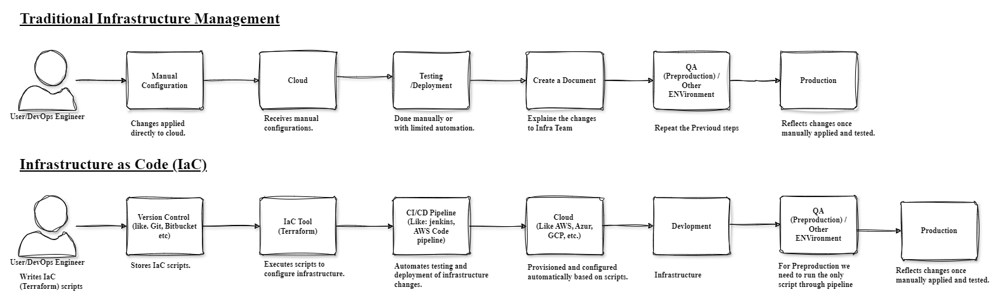

    <h1>01. Introduction to Terraform</h1>
    <i>This is the Terraform Introduction.</i>

 

---

 

# Index

- [What is Terraform?](#what-is-terraform)
  - [Brief overview of Infrastructure as Code (IaC)](#brief-overview-of-infrastructure-as-code-iac)
  - [Understand Problems with Traditional way of Managing Infrastructure](#understand-roblems-with-traditional-way-of-managing-infrastructure)
  - [How Terraform Solves them](#how-terraform-solves-them)
- [Why Learn Terraform?](#why-learn-terraform)

  - [Industry demand](#industry-demand)
  - [Versatility across cloud providers](#versatility-across-cloud-providers)

  **[⬆ Back to index](#index)**

## What is Terraform?

- Terraform is an `Infrastructure as Code` software tool created by [HashiCorp](https://www.hashicorp.com/).
- Users define and provide data center infrastructure using a declarative configuration language known as `HashiCorp Configuration Language (HCL)`, or optionally `JSON`.
- Terraform creates and manages resources on cloud platforms and other services through their `application programming interfaces` (APIs).
  
- The core Terraform workflow consists of three stages:
  
  **[⬆ Back to index](#index)**

  

### Brief overview of Infrastructure as Code (IaC)

- [IaC](https://en.wikipedia.org/wiki/Infrastructure_as_code) stands for `Infrastructure as Code`.
- It's a concept in [software engineering](https://en.wikipedia.org/wiki/Software_engineering) where infrastructure [provisioning](https://en.wikipedia.org/wiki/Provisioning) and [management](https://en.wikipedia.org/wiki/Management) is done through `code` rather than `manual processes`.
  **[⬆ Back to index](#index)**

### Understand Problems with Traditional way of Managing Infrastructure

Traditional methods of managing infrastructure, often involving manual processes and ad-hoc configurations, pose several challenges compared to modern approaches like Infrastructure as Code (IaC).

1.  **Manual Configuration**: Traditional infrastructure management relies heavily on manual configuration tasks, which are time-consuming, error-prone, and lack consistency. Manual interventions increase the risk of misconfigurations and inconsistencies across environments.

2.  **Lack of Version Control**: Traditional methods often lack version control mechanisms for infrastructure configurations. Changes made directly to servers or network devices are not tracked systematically, making it difficult to audit, rollback, or reproduce configurations reliably.

3.  **Limited Automation**: Manual processes limit the extent of automation in infrastructure management. Tasks like provisioning servers, deploying applications, and configuring network settings require human intervention, leading to slower deployment cycles and increased operational overhead.

4.  **Difficulty in Scaling**: Scaling infrastructure manually becomes challenging as the complexity and size of the environment grow. Adding new servers or expanding network capacity involves repetitive tasks and coordination efforts, which are prone to errors and delays.

5.  **Limited Visibility and Control**: Traditional methods often lack visibility into the overall state and health of the infrastructure. Monitoring, troubleshooting, and enforcing compliance become challenging without centralized monitoring and management tools.

6.  **High Risk of Downtime**: Manual interventions and ad-hoc configurations increase the risk of downtime and service disruptions. Human errors, misconfigurations, and lack of testing can lead to outages, impacting business continuity and user experience.

7.  **Dependency on Tribal Knowledge**: Traditional infrastructure management relies heavily on tribal knowledge and individual expertise. Critical configurations and procedures may be known to only a few individuals, leading to knowledge silos and dependency risks.

8.  **Slow Recovery Times**: In the event of failures or disasters, recovering infrastructure to a known good state can be slow and cumbersome with traditional methods. Lack of automated recovery procedures and backups prolongs recovery times and increases downtime.

9.  **Difficulty in Compliance and Auditing**: Meeting regulatory compliance requirements and passing audits becomes challenging without systematic documentation, change tracking, and adherence to best practices. Manual processes lack the rigor and consistency needed for compliance efforts.

Overall, the traditional way of managing infrastructure is characterized by manual effort, lack of automation, limited visibility, and increased operational risks. Transitioning to modern approaches like Infrastructure as Code addresses these challenges by promoting automation, consistency, scalability, and resilience in infrastructure management.
**[⬆ Back to index](#index)**

### How Terraform Solves them

Infrastructure as Code (IaC) with Terraform addresses many of the challenges associated with traditional infrastructure management methods. Here's how:

1. **Automation**: Terraform automates infrastructure provisioning and configuration, eliminating manual intervention and reducing the risk of human error. Tasks such as resource provisioning, network setup, and application deployment can be fully automated using Terraform configuration files.

2. **Version Control**: Terraform configuration files are treated as code and can be managed using version control systems like `Git`. This enables teams to track changes, collaborate effectively, and revert to previous configurations if needed, ensuring consistency and reliability.

3. **Consistency**: Terraform enforces infrastructure configurations declaratively, ensuring that the desired state is consistently applied across environments. By defining infrastructure as code, teams can maintain consistency in configurations, reducing configuration drift and operational inconsistencies.

4. **Scalability**: Terraform simplifies the process of scaling infrastructure resources up or down based on demand. With Terraform, adding new servers, increasing network capacity, or deploying additional resources can be accomplished with minimal effort by modifying configuration files.

5. **Visibility and Control**: Terraform provides visibility into the entire infrastructure through its state management and execution plans. Operators can visualize the relationships between resources, monitor changes, and enforce policies using Terraform's command-line interface and web-based tools.

6. **Fast Recovery Times**: Terraform enables rapid recovery from failures or disasters through its automated provisioning and configuration capabilities. By defining infrastructure as code, recovery procedures can be scripted and executed quickly, minimizing downtime and restoring services to a known good state.

7. **Compliance and Auditing**: Terraform's code-based approach to infrastructure management facilitates compliance efforts by allowing organizations to define and enforce policies as code. By adhering to predefined configurations and best practices, Terraform helps ensure compliance with regulatory requirements and simplifies audit processes.

8. **Dependency on Tribal Knowledge Reduction**: Terraform's declarative syntax and modular design promote collaboration and knowledge sharing among team members. By encapsulating infrastructure configurations in reusable modules and standardizing deployment practices, Terraform reduces dependency on individual expertise and tribal knowledge.

9. **Immutable Infrastructure**: Terraform encourages the adoption of immutable infrastructure patterns, where infrastructure components are treated as disposable and replaced rather than modified in place. This enhances resilience, simplifies rollbacks, and reduces the risk of configuration drift.

Overall, Terraform's IaC approach revolutionizes infrastructure management by automating provisioning, enforcing consistency, enhancing visibility, and promoting collaboration, thereby addressing many of the challenges associated with traditional infrastructure management methods.
**[⬆ Back to index](#index)**

## Why Learn Terraform?

Terraform is a leading tool for IaC, which allows you to manage and provision infrastructure through `code` instead of `manual processes`.
**[⬆ Back to index](#index)**

### Industry demand

- `Job Market`: As organizations increasingly adopt cloud services and IaC, there is a growing demand for professionals skilled in Terraform.
- `Career Advancement`: Knowledge of Terraform can open up opportunities for roles in DevOps, cloud engineering, and infrastructure management.
  **[⬆ Back to index](#index)**

### Versatility across cloud providers

- `Versatility`: Terraform supports a wide range of cloud providers, including `AWS`, `Azure`, `Google Cloud`, and many others.
- `Unified Language`: Allows you to use a single configuration language to manage resources across different cloud platforms, reducing complexity.
  **[⬆ Back to index](#index)**
