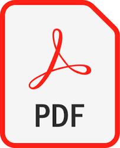

    <h1>Terraform On AWS Cloud</h1>
    <i>This is the Terraform AWS Cloud repository, your go-to resource for learning Infrastructure as Code with Terraform.</i>

 

---

# Index

## [01. Introduction to Terraform](01-introduction-to-terraform/README.md)

- [What is Terraform?](01-introduction-to-terraform#what-is-terraform)
  - Brief overview of Infrastructure as Code (IaC)
  - Understand Problems with Traditional way of Managing Infrastructure
  - How Terraform Solves them
- [Why Learn Terraform?](01-introduction-to-terraform#why-learn-terraform)
  - Industry demand
  - Versatility across cloud providers

## [Reference Url](https://docs.google.com/presentation/d/1tlv_1m1dpbwTMNpCFXc3KxsV8aArDxKX2iE4XiauSkE/edit?usp=drive_link)

- You can view the PDF document
  

---

This structure provides a comprehensive guide to Terraform, catering to beginners and intermediate users. Tailoring each section with engaging visuals, practical examples, and clear explanations will make the video both informative and enjoyable for your audience.

**[⬆ Back to index](#index)**
